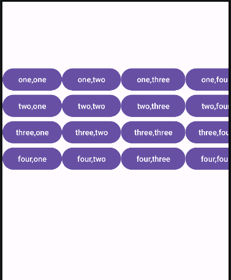
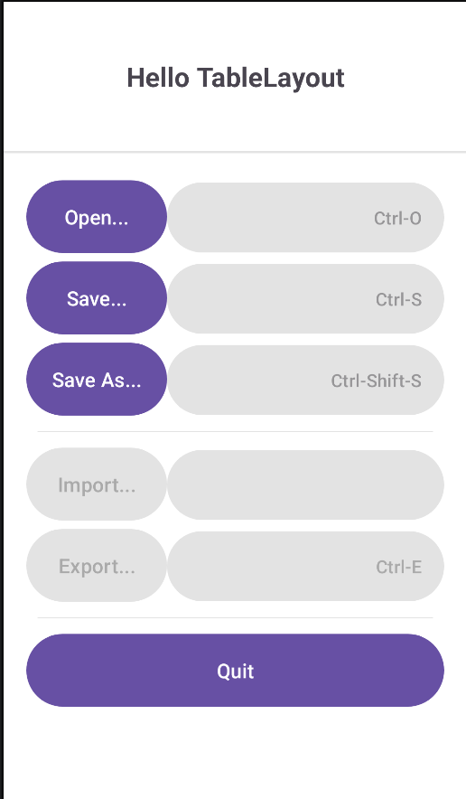
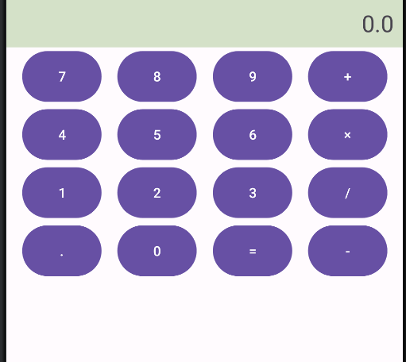
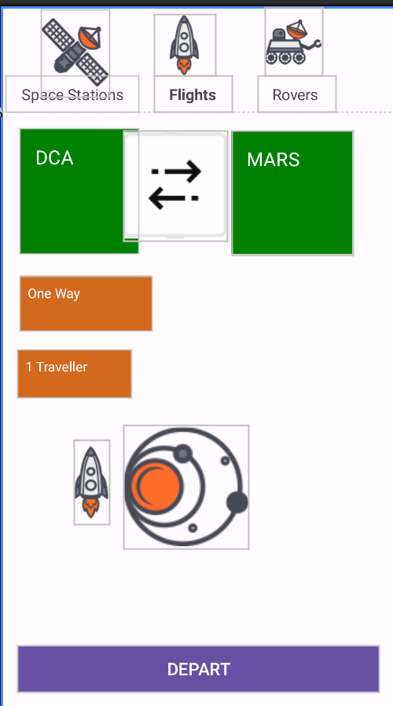

# Android 布局与多页面应用实验报告

## 一、实验目的

1. 掌握 Android 中多种布局管理器的使用（LinearLayout、TableLayout、ConstraintLayout）
2. 学会通过 Java 代码动态创建 UI 元素
3. 理解 Activity 的基本概念及生命周期
4. 掌握多页面应用的搭建方法

## 二、实验环境

- 操作系统：Windows 10
- 开发工具：Android Studio Giraffe
- SDK 版本：Android 13 (API 33)

## 三、实验内容与步骤

### 3.1 项目结构设计

创建包含 4 个 Activity 的应用，分别实现不同的布局效果：

- Activity1：基础页面展示
- Activity2：通过 Java 代码动态创建 TableLayout
- Activity3：计算器界面（XML 布局实现）
- Activity4：太空主题应用界面（ConstraintLayout 实现）

### 3.2 主要布局实现

#### 3.2.1 Activity1 实现

使用 ConstraintLayout 作为根布局，包含一个 TableLayout 展示按钮网格：

```xml
<androidx.constraintlayout.widget.ConstraintLayout ...>
    <TableLayout
        android:id="@+id/TableLayout2"
        android:layout_width="fill_parent"
        android:layout_height="wrap_content"
        android:stretchColumns="1"
        ...>
        <!-- 4行4列按钮 -->
    </TableLayout>
</androidx.constraintlayout.widget.ConstraintLayout>
```

在 Java 代码中设置页面标题：

```java
public class Activity1 extends AppCompatActivity {
    @Override
    protected void onCreate(Bundle savedInstanceState) {
        super.onCreate(savedInstanceState);
        setContentView(R.layout.activity1);
        TextView textView = findViewById(R.id.activity1);
        textView.setText("这是页面1");
    }
}
```

#### 3.2.2 Activity2 动态布局实现

通过 Java 代码动态创建线性布局和表格布局：

```java
// 创建主布局
LinearLayout mainLayout = new LinearLayout(this);
mainLayout.setLayoutParams(new LinearLayout.LayoutParams(
        LinearLayout.LayoutParams.MATCH_PARENT,
        LinearLayout.LayoutParams.MATCH_PARENT
));
mainLayout.setOrientation(LinearLayout.VERTICAL);
mainLayout.setBackgroundColor(Color.WHITE);

// 创建表格布局
TableLayout tableLayout = new TableLayout(this);
tableLayout.setLayoutParams(new TableLayout.LayoutParams(
        TableLayout.LayoutParams.MATCH_PARENT,
        TableLayout.LayoutParams.WRAP_CONTENT
));
// 添加表格行
addTableRow(tableLayout, "Open...", "Ctrl-O", true);
addTableRow(tableLayout, "Save...", "Ctrl-S", true);
// ...添加更多行
```

实现表格行添加方法：

```java
private void addTableRow(TableLayout table, String leftText, String rightText, boolean enabled) {
    TableRow row = new TableRow(this);
    // 创建左右文本视图
    TextView leftTextView = new TextView(this);
    leftTextView.setText(leftText);
    // ...设置文本属性
    
    TextView rightTextView = new TextView(this);
    rightTextView.setText(rightText);
    // ...设置文本属性
    
    row.addView(leftTextView);
    row.addView(rightTextView);
    table.addView(row);
}
```

#### 3.2.3 Activity3 计算器界面

使用 ConstraintLayout 实现计算器布局，包含数字按钮和运算符按钮：

```xml
<androidx.constraintlayout.widget.ConstraintLayout ...>
    <!-- 显示区域 -->
    <TextView
        android:id="@+id/tv_display"
        android:layout_width="0dp"
        android:layout_height="50dp"
        android:background="#D4E1C8"
        android:gravity="right|center_vertical"
        ... />
    
    <!-- 数字按钮和运算符按钮 -->
    <Button
        android:id="@+id/btn_7"
        android:layout_width="0dp"
        android:layout_height="60dp"
        android:text="7"
        ... />
    <!-- 其他按钮 -->
</androidx.constraintlayout.widget.ConstraintLayout>
```

在 Java 代码中绑定按钮资源：

```java
public class Activity3 extends AppCompatActivity {
    private Button b1, b2, b3, b4, b5, b6, b7, b8, b9, b0;
    private Button b_point, b_jia, b_jian, b_deng, b_cheng, b_chu;
    
    @Override
    protected void onCreate(Bundle savedInstanceState) {
        super.onCreate(savedInstanceState);
        setContentView(R.layout.activity3);
        
        // 绑定所有按钮
        b0 = findViewById(R.id.btn_0);
        b1 = findViewById(R.id.btn_1);
        // ...绑定其他按钮
    }
}
```

#### 3.2.4 Activity4 太空主题界面

使用 ConstraintLayout 实现包含标签栏和内容区的复杂布局：

```xml
<androidx.constraintlayout.widget.ConstraintLayout ...>
    <!-- 顶部标签栏 -->
    <TextView
        android:id="@+id/tab_stations"
        android:layout_width="wrap_content"
        android:layout_height="wrap_content"
        android:text="Space Stations"
        ... />
    
    <!-- 内容区域 -->
    <TextView
        android:id="@+id/dca"
        android:layout_width="124dp"
        android:layout_height="131dp"
        android:background="#008000"
        android:text="DCA"
        ... />
    
    <!-- 底部按钮 -->
    <Button
        android:id="@+id/depart"
        android:layout_width="0dp"
        android:layout_height="wrap_content"
        android:text="DEPART"
        ... />
</androidx.constraintlayout.widget.ConstraintLayout>
```

## 四、实验结果与分析

### 4.1 各页面运行效果

1. **Activity1**：展示了一个 4x4 的按钮网格，使用 TableLayout 实现，按钮均匀分布在整个屏幕宽度上。

   截图展示：

   

2. **Activity2**：通过 Java 代码动态创建了一个类似菜单的界面，包含可点击项和分隔线，点击菜单项会显示 Toast 提示，实现了良好的交互效果。

   截图展示：

   

3. **Activity3**：实现了一个标准的计算器布局，按钮排列整齐，数字区和运算符区分明确，为后续实现计算功能奠定了基础。

   截图展示：

   

4. **Activity4**：创建了一个太空主题的界面，包含顶部标签栏、中间内容区和底部操作按钮，使用 ConstraintLayout 精确控制了各元素的位置关系。

5. 截图展示：

   

### 4.2 布局对比分析

| 布局方式         | 优点                 | 缺点               | 适用场景           |
| ---------------- | -------------------- | ------------------ | ------------------ |
| LinearLayout     | 简单直观，易于使用   | 复杂布局嵌套层级多 | 简单线性排列的界面 |
| TableLayout      | 适合展示表格数据     | 不够灵活           | 类似表格的结构展示 |
| ConstraintLayout | 灵活度高，减少嵌套   | 学习成本较高       | 复杂界面布局       |
| 动态布局         | 高度灵活，可动态调整 | 代码冗长，维护困难 | 需要动态生成的 UI  |

## 五、实验总结与体会

1. 通过本次实验，掌握了 Android 中多种布局方式的使用，理解了不同布局的适用场景。
2. 学会了两种创建 UI 的方式：XML 静态布局和 Java 代码动态创建，了解到 XML 布局更适合静态界面，而动态布局适合需要根据数据动态生成的界面。
3. 理解了 Activity 作为 Android 应用基本组件的作用，为后续实现页面跳转和数据传递打下了基础。
4. 体会到良好的布局设计对应用用户体验的重要性，合理选择布局方式可以提高界面性能和开发效率。
5. 后续可以进一步完善各页面的交互逻辑，实现页面间的跳转功能，以及计算器的运算功能。

## 六、问题与解决方法

1. **问题**：使用 TableLayout 时按钮无法均匀分布**解决**：设置`android:stretchColumns="*"`使所有列平均拉伸
2. **问题**：动态创建的布局在不同屏幕尺寸上显示不一致**解决**：使用相对布局参数而非固定尺寸，确保适配不同屏幕
3. **问题**：ConstraintLayout 中控件约束关系设置错误导致布局混乱**解决**：仔细检查每个控件的约束条件，确保每个方向都有明确约束
